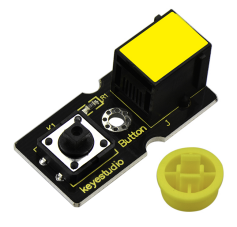
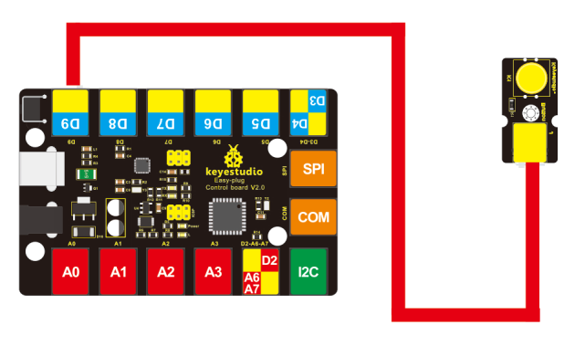
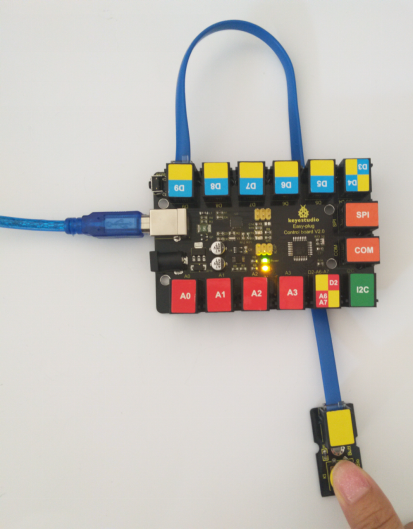
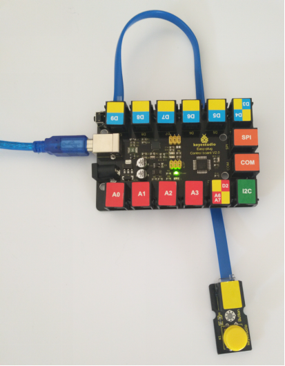

# KS0112 keyestudio EASY plug Digital Push Button



## 1. Introduction

The EASY Plug Push-button module is a tidy little design that lets you control a DC power source using an everyday tactile button.

This basic application module is widely applied to Arduino, Raspberry Pi platforms.

When the button is pressed, it outputs HIGH level signal; if release the button, it outputs LOW level signal.

You can simply connect to an IO port to have your first taste of Arduino.This sensor needs to be used together with EASY plug control board.

**Special Note:**

The sensor/module is equipped with the RJ11 6P6C interface, compatible with our keyestudio EASY plug Control Board with RJ11 6P6C interface.

If you have the control board of other brands, it is also equipped with the RJ11 6P6C interface but has different internal line sequence, can’t be used compatibly with our sensor/module.

## 2. Specification

- Connector: Easy plug
- Supply Voltage: 3.3V to 5V
- Large button and high-quality top cap
- Sensor type: Digital

## 3. Technical Details

- Dimensions: 38mm * 20mm * 18mm
- Weight: 5.6g

## 4. Connect It Up

Connect the EASY Plug push button sensor and LED module to control board using RJ11 cables. Then connect the control board to your PC with a USB cable.



## 5. Upload the Code

Download code:  [Code](./Code.7z)

```c
int ledPin = 13;// choose the pin for the LED
int inputPin = 9;// Connect sensor to input pin 9

void setup() 
{
    pinMode(ledPin, OUTPUT);// declare LED as output
    pinMode(inputPin, INPUT);// declare pushbutton as input
}

void loop()
{
    int val = digitalRead(inputPin);// read input value
    if (val == HIGH) // check if the input is HIGH
    { 
    	digitalWrite(ledPin, LOW);// turn LED OFF
    } 
    else 
    {
    	digitalWrite(ledPin, HIGH);// turn LED ON
    }
}
```

## 6. Result

Powered up and upload well the code, press down the button, D13 indicator on the control board is turned on. While release the button, indicator LED is off.

 

